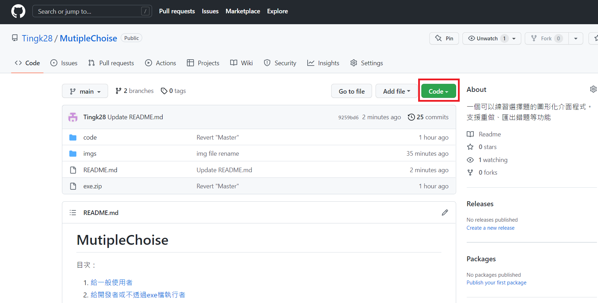

# MutipleChoise
目次：
1. [給一般使用者](#給一般使用者)
    1. [下載與安裝](#下載與安裝)
    2. [自定義題目資料夾](#自定義題目資料夾)
    3. [自動翻譯功能設定](#自動翻譯功能設定)
    4. [基本介面介紹](#基本介面介紹)
    5. [使用方法](#使用方法)
2. [給開發者或不透過exe檔執行者](#給開發者或不透過exe檔執行者)
    1. [所需的package](#所需的package)
    2. [json題目格式](#json題目格式)
    3. [打包成exe檔的方法](#打包成exe檔的方法)

---

本程式提供給大家一個匯入並練習選擇題的平台，基礎的功能包含
1. 打亂題目與選項的順序（並可手動重做）
2. 導入google翻譯可藉由選取自動翻譯
3. 匯出做錯的題目以供日後重新匯入練習

未來將新增「匯出的題目檔案合併」、「輸入練習題創建練習檔」等功能。
以下將對程式使用方法、以及題目檔格式等作說明
> 暫時不支援macOS。實測使用原始碼於macOS執行，會有跑版問題。有時間會解決。
> exe檔的部分僅能於Windows上執行，還請多見諒。

> 備註：本文檔提供給系上無相關程式背景或初學者的同學，故寫的較為詳細
> 有任何問題歡迎跟我聯絡！

## 給一般使用者
### 下載與安裝
進入github連結後會看到如下畫面，請點擊紅框處綠色的Code按鈕並選擇Download Zip進行下載。<br>


下載後會得到一個壓縮檔，解壓縮後裡面還有個`exe.zip` ，將`exe.zip`再次解壓縮後裡面有`dist`與`build`資料夾（如下圖）<br>


**打開`dist`資料夾，後續所有操作均在此資料夾進行**<br>


### 自定義題目資料夾
dist 資料夾中有一`multi json`的資料夾，放在此處的json檔將會出現在程式file標籤列的open項下．建議將常用的題目放於此處，不需要每次重新手動匯入

> 補充：json檔為一種常見的檔案格式，本軟體所有的題目均存為json。
> 詳見下方「題目格式」

### 自動翻譯功能設定
自動翻譯功能需要用到Chrome瀏覽器，並且需要安裝webdriver。若未正確安裝webdriver，程式將會給予相對應的提示，仍可繼續使用其他功能
**Webdriver會因瀏覽器更新而過期，需要使用者前往[本網站](https://chromedriver.chromium.org/downloads)按照下列指示進行安裝後方可使用**

- Chrome瀏覽器版本查詢
打開Chrome 設定選單，選擇關於Chrome，或直接輸入chrome://settings/help 到達以下頁面


以上圖為例，版本為106
- webdriver下載
接著到Chrome driver官方[下載頁面](https://chromedriver.chromium.org/downloads) https://chromedriver.chromium.org/downloads 

接續前面範例，選擇106的版本
**注意：請依照自身瀏覽器版本選擇下載的檔案、而非下載最新版**


接著選取**chromedriver_win32.zip**，注意不論是32或64位元的版本均下載此檔案即可

- webdriver安裝
打開剛剛下載的`chromedriver_win32.zip`如下圖所示，直接將`webdriver.exe`拖入`dist`資料夾中並直接取代原本的檔案即可<br>


恭喜！到這邊已經完成基本的環境設定與安裝了
### 基本介面介紹
完成基本題目匯入與webdriver設定後即可使用全部功能
開啟程式後，程式會自動打開Chrome瀏覽器並進入Google翻譯

- file：可以開啟已有的json檔案，並將目前為止做錯的題目另存為json檔
- text size：設定題目顯示區域的文字大小
- timeout(ms)：自動翻譯框選文字的時間，設定越短，框選的時間越少，但同時縮短翻譯的反應時間（建議使用預設的1秒）。
- about：程式基本訊息，可找到本專案的github說明網址
### 使用方法
使用exe檔執行可能會遇到windows defender 回報軟體可能不安全，需要選擇「信任此程式」或暫時關閉windows defender，若遇到此問題可以[直接執行python檔](#給開發者或不透過exe檔執行者)
1. 一開始請先透過file>open選單打開題目檔，可以透過`load from`手動匯入路徑．或用打開已經存放在`multi json`資料夾中的檔案。<>

3. 透過下圖的下拉式選單選擇要練習的章節，或選擇「所有章節」一次性匯入該檔案中所有題目，此時可以勾選右邊「跳過是非」、「順序隨機」來略過是非題或打散題目順序。<br>

5. 選擇章節與匯入設定後，按下`Change LO`按鈕開始匯入題目。
6. 按下對應的ＡＢＣＤ按紐來答題，亦可以透過1234來選擇ＡＢＣＤ。是非題中1代表False，2代表True。
7. 按下enter或右方向鍵可以到下一題，按下左方向鍵則可回到上一題。
8. 做題過程中可以隨時框選題目中的文字，將會自動帶入Chrome中。或在題目區中按下滑鼠右鍵點擊「翻譯」則可翻譯整個題目。（框選兩三個單字時可能會變成整段選取，可以調整timeout的時間，或翻譯整個題目後，再在google翻譯中選取）
9. **注意：若過程中不慎將google翻譯關閉，將導致程式暫時沒有回應，稍待片刻後程式即恢復正常，但瀏覽器將不會再重新啟動，並不再支援翻譯功能（須將程式重啟）**
10. 若答題時對於該題不滿意，可以按下`Redo`按鈕，程式將打散選項順序，並且重置選項按鈕功能。
11. 作答過程中（或已完成作答）可以使用file>save as將做錯的題目匯出為一個json檔，並在未來使用load from功能重新開啟
12. **若有不熟悉的題目希望標記，請使用redo功能手動做錯標記**


## 給開發者或不透過exe檔執行者
> 提示：可使用`git clone`下載檔案

### 所需的package
本程式使用`PySimpleGUI`完成基本GUI搭建，並用`selenium`來實現翻譯功能

使用前請先執行下列程式碼方能使用。
``` =
pip install selenium
pip install PySimpleGUI
```

### json題目格式
所有題目採用.json儲存，題目檔的格式如下：
1. 最外面為一個dictionary，以章節名稱為key，題目組成的list為其value
2. 題目數個dictionary組成，包含`"question"` `"choice"` `"ans"` 三個key
3. 因為python Zero-base的特性，選擇題ans的值為`0-3`對應答案`A-D`
4. 承上，是非題無`"choice"` 的key，答案為`"T"` 或`"F"` 
5. **選項與題目都須以`\n`做結尾，以達到換行的效果**

範例如下
```
{
  "章節名稱一": [
    {
      "question": "題目一\n",
      "choice": [
        "選項A內容\n",
        "選項B內容\n",
        "選項C內容\n",
        "選項D內容\n"
      ],
      "ans": 0
    },
    {
      "question": "題目二\n",
      "choice": [
        "選項A內容\n",
        "選項B內容\n",
        "選項C內容\n",
        "選項D內容\n"
      ],
      "ans": 2
    },
    {
      "question": "是非題敘述\n",
      "ans": "T"
    },
    {
      "question": "是非題敘述二\n",
      "ans": "F"
    }
  ],
  "章節名稱二": [
        {
      "question": "題目一\n",
      "choice": [
        "選項A內容\n",
        "選項B內容\n",
        "選項C內容\n",
        "選項D內容\n"
      ],
      "ans": 0
    }
  ]
}
```
> 圖片
### 打包成exe檔的方法
若要將程式打包成`.exe`檔，以下提供使用`pyinstaller`的範例
1. 安裝package
```=
pip install pyinstaller
```
2. 在cmd中打開`main.py`所在的資料夾，並執行下列指令。
<br />其中`-w`為不顯示console，`--icon`則為設定icon圖示。

```=
pyinstaller -F main.py -w --icon=icon.ico
```
3. 第一次使用可能會發現webdriver的console被打開了，請參照[這篇文章](https://stackoverflow.com/questions/52643556/getting-rid-of-chromedirver-console-window-with-pyinstaller)來獲得解決。

4. 執行2.後會產生`dist`與`build`資料夾，執行dist中的.exe即可。

## Todos
未來預計會新增的功能有：
1. 能建立題目的gui
2. 合併多個題目檔的功能
3. macOS系統支援
